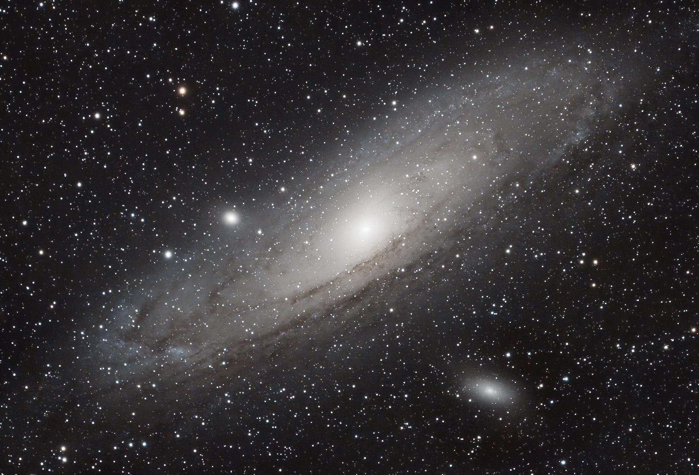

[The Andromeda Galaxy](https://en.wikipedia.org/wiki/Andromeda_Galaxy)  (IPA: /ænˈdrɒmɪdə/), also known as Messier 31, M31, or NGC 224 and originally the Andromeda Nebula (see below), is a barred spiral galaxy with diameter of about 220,000 ly approximately 2.5 million light-years (770 kiloparsecs) from Earth and the nearest large galaxy to the Milky Way. The galaxy's name stems from the area of Earth's sky in which it appears, the constellation of Andromeda, which itself is named after the Ethiopian (or Phoenician) princess who was the wife of Perseus in Greek mythology.

The virial mass of the Andromeda Galaxy is of the same order of magnitude as that of the Milky Way, at 1 trillion solar masses (2.0×1042 kilograms). The mass of either galaxy is difficult to estimate with any accuracy, but it was long thought that the Andromeda Galaxy is more massive than the Milky Way by a margin of some 25% to 50%. This has been called into question by a 2018 study that cited a lower estimate on the mass of the Andromeda Galaxy, combined with preliminary reports on a 2019 study estimating a higher mass of the Milky Way. The Andromeda Galaxy has a diameter of about 220,000 ly (67 kpc), making it the largest member of the Local Group in terms of extension.

The Milky Way and Andromeda galaxies are expected to collide in around 4-5 billion years, merging to form a giant elliptical galaxy or a large lenticular galaxy. With an apparent magnitude of 3.4, the Andromeda Galaxy is among the brightest of the Messier objects, making it visible to the naked eye from Earth on moonless nights, even when viewed from areas with moderate light pollution.

仙女座星系（Andromeda Galaxy，国际音标为：/ˌanˈdrɒmədə/，也称为梅西耶31、星表编号为M31和NGC 224，在旧文献中曾经称为仙女座星云，在中国古代被称为奎宿增廿一）是一个螺旋星系，距离地球大约250万光年，是除麦哲伦云（地球所在的银河系的伴星系）以外最近的星系。位于仙女座的方向上，是人类肉眼可见（3.4等星）最远的深空天体。 仙女座星系被相信是本星系群中最大的星系，直径约20万光年，外表颇似银河系。本星系群的成员有仙女星系、银河系、三角座星系，还有大约50个小星系。但根据改进的测量技术和二十一世纪初研究的数据结果，科学家现在相信银河系有许多的暗物质，并且可能是在这个集团中质量最大的。 然而，史匹哲太空望远镜最近的观测显示仙女座星系有将近一兆（1012）颗恒星，数量远比我们的银河系多。在2006年重新估计银河系的质量大约是仙女座星系的50％，是7.1×1011M☉.仙女座星系在适度黑暗的天空环境下很容易用肉眼看见，但是如此的天空仅存在于小镇、被隔绝的区域、和离人口集中区域很远的地方，只受到轻度光污染的环境下。肉眼看见的仙女座星系非常小，因为它只有中心一小块的区域有足够的亮度，但是这个星系完整的角直径有满月的七倍大。

---

SPECS:
- Location: Beijing
- Bortle Scale: 6
- L: 100 * 30
- R: 200 * 50
- G: 200 * 50
- B: 200 * 50
- Software: PixInsight, DeNoise AI

DEVICES:
- Telescope: WO Redcat51
- Filter Wheel: ZWO 7*36mm EFW Filters: LRGB, Ha 7nm, SII 6.5nm, OIII 6.5nm
- Main Camera: ZWO 294MMP
- Guiding Camera: ZWO 290mini
- Focuser: ZWO EAF
- Computer: ZWO ASIAIR Plus
- Mount: RST-135
- Tripod: RT90C