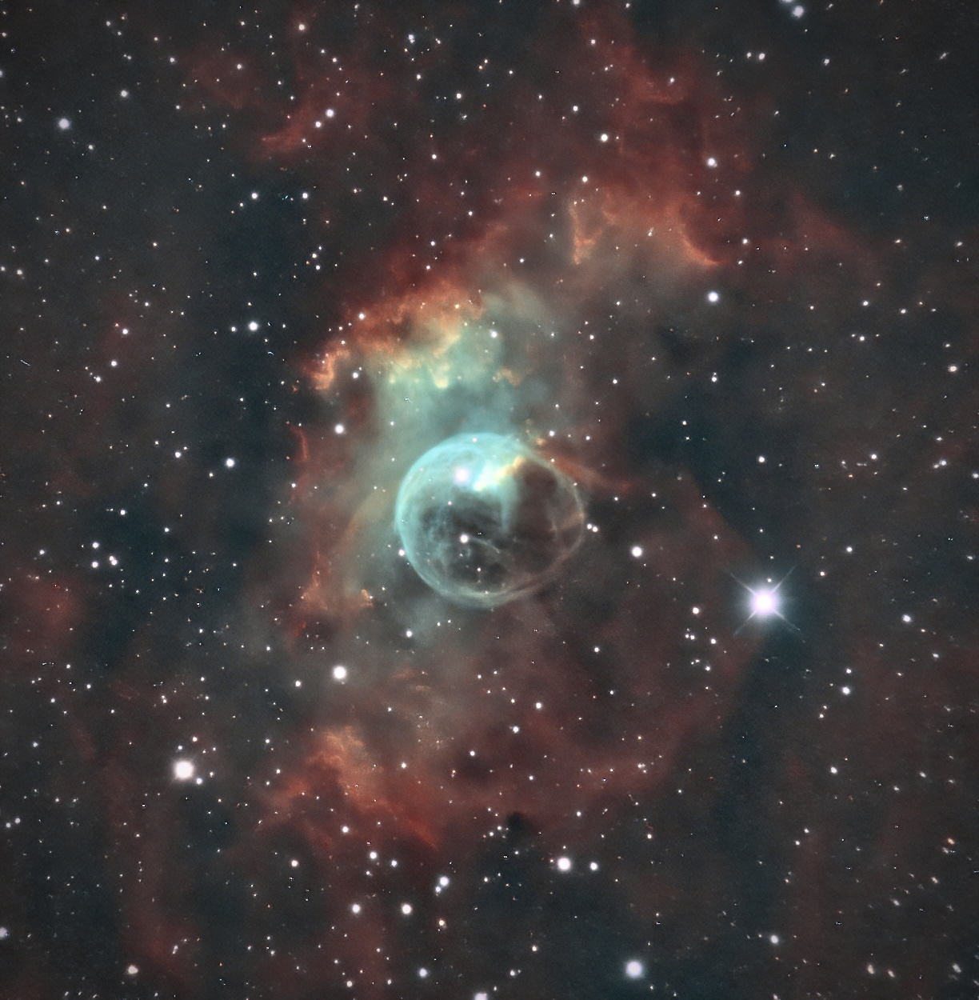

[NGC 7635](https://en.wikipedia.org/wiki/NGC_7635), also known as the Bubble Nebula, Sharpless 162, or Caldwell 11, is an H II region emission nebula in the constellation Cassiopeia. It lies close to the direction of the open cluster Messier 52. The "bubble" is created by the stellar wind from a massive hot, 8.7 magnitude young central star, SAO 20575 (BD+60°2522). The nebula is near a giant molecular cloud which contains the expansion of the bubble nebula while itself being excited by the hot central star, causing it to glow. It was discovered in 1787 by William Herschel. The star BD+60°2522 is thought to have a mass of about 44 M☉.

NGC 7635，也称为气泡星云、Sharpless 162或Caldwell 11，是在仙后座内，靠近疏散星团M52的一个电离氢区发射星云。这个"气泡"是由一颗视星等+8.7的年轻高温恒星SAO 20575 (BD+60 2522)创造的，它的质量大约是15± 5M☉。这个气泡靠近巨大的分子云，当它本身被中心的恒星激发时，包含了这个膨胀的气泡星云，并造成了它的成长。这个星云是 在1787年被威廉·赫歇尔发现的，恒星SAO 20575或BD+602522的质量估计是44倍太阳质量。

---

SPECS: 
- Location: Spain
- Remote Observatory SPA-2