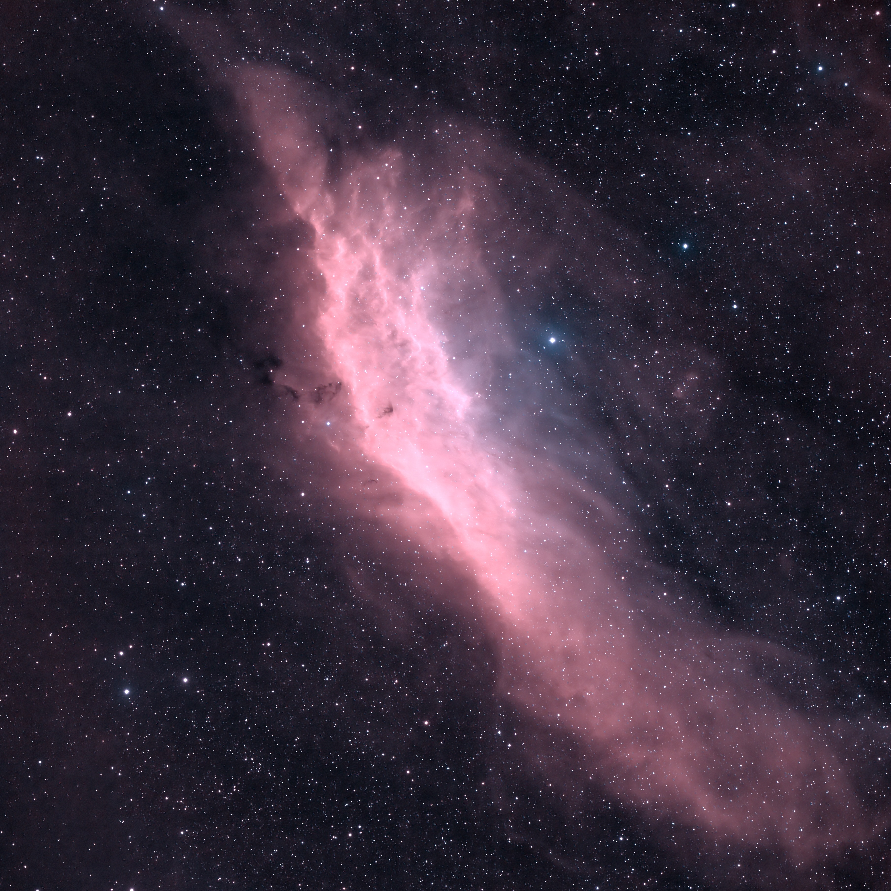

[The California Nebula](https://en.wikipedia.org/wiki/California_Nebula) (NGC 1499/Sh2-220) is an emission nebula located in the constellation Perseus. Its name comes from its resemblance to the outline of the US State of California in long exposure photographs. It is almost 2.5° long on the sky and, because of its very low surface brightness, it is extremely difficult to observe visually. It can be observed with a Hα filter (isolates the Hα line at 656 nm) or Hβ filter (isolates the Hβ line at 486 nm) in a rich-field telescope under dark skies. It lies at a distance of about 1,000 light years from Earth. Its fluorescence is due to excitation of the Hβ line in the nebula by the nearby prodigiously energetic O7 star, Xi Persei (also known as Menkib, seen at center below it in the inset at right).

The California Nebula was discovered by E. E. Barnard in 1884.

By coincidence, the California Nebula transits in the zenith in central California as the latitude matches the declination of the object.

NGC 1499俗称加利福尼亚星云或加州星云（California Nebula），是位于英仙座的发射星云，距离地球约1,000光年，最初在1884年由美国天文学家巴纳德发现。它的名称来自它酷似美国加利福尼亚州的轮廓。加利福尼亚星云的视直径可达2.5°，但由于从望远镜观测得的表面亮度非常低（约14等左右），所以很难以裸眼进行目视观测，宜使用广视野望远镜，配合Hβ滤镜（波长486奈米），在低光害的夜空环境下拍摄。

---

SPECS:
- Location: Beijing
- Bortle Scale: 6
- Ha: 40 * 300
- Sii: 60 * 300
- Oiii: 60 * 300
- Software: PixInsight, DeNoise AI

DEVICES:
- Telescope: WO Redcat51
- Filter Wheel: ZWO 7*36mm EFW Filters: LRGB, Ha 7nm, SII 6.5nm, OIII 6.5nm
- Main Camera: ZWO 294MMP
- Guiding Camera: ZWO 290mini
- Focuser: ZWO EAF
- Computer: ZWO ASIAIR Plus
- Mount: RST-135
- Tripod: RT90C