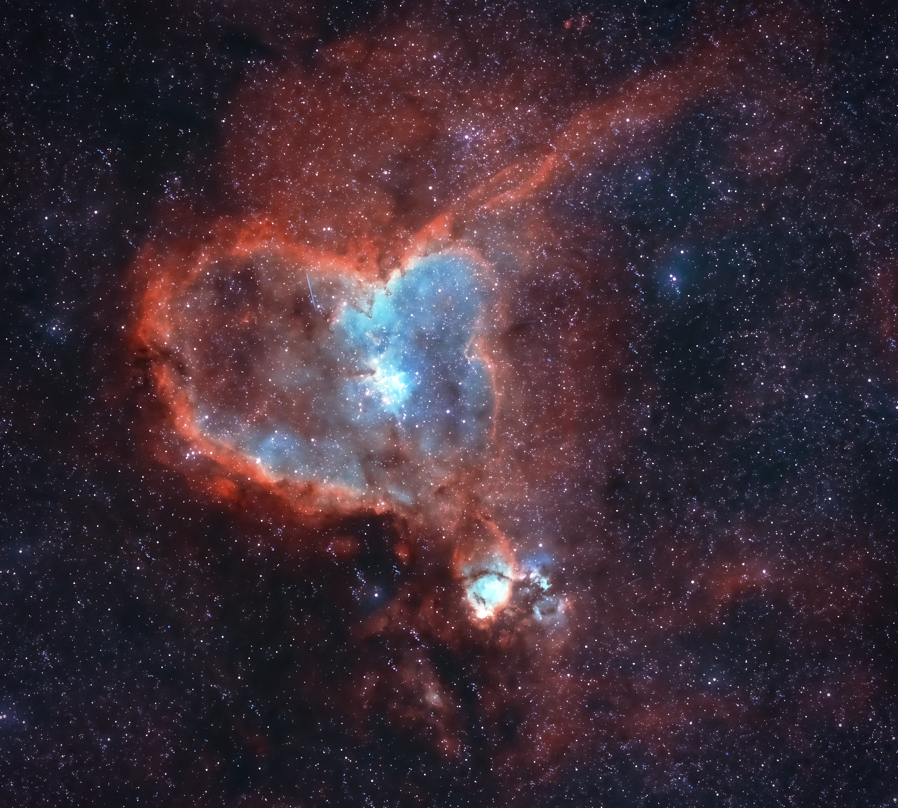

[The Heart Nebula](https://en.wikipedia.org/wiki/Heart_Nebula) (also known as the Running dog nebula), IC 1805, Sharpless 2-190, is some 7500 light years away from Earth and is located in the Perseus Arm of the Galaxy in the constellation Cassiopeia. It was discovered by William Herschel on 3 November 1787. It is an emission nebula showing glowing ionized hydrogen gas and darker dust lanes.

The brightest part of the nebula (a knot at its western edge) is separately classified as NGC 896, because it was the first part of the nebula to be discovered. The nebula's intense red output and its morphology are driven by the radiation emanating from a small group of stars near the nebula's center. This open cluster of stars, known as Collinder 26 or Melotte 15, contains a few bright stars nearly 50 times the mass of our Sun, and many more dim stars that are only a fraction of our Sun's mass.

The Heart Nebula is also made up of ionised Oxygen and Sulfur gasses, responsible for the rich blue and orange colours seen in narrowband images. The shape of the nebula is driven by stellar winds from the hot stars in its core. The nebula also spans almost 2 degrees in the sky, covering an area four times that of the diameter of the full moon.

心脏星云，或称为心状星云（Heart Nebula），即 IC 1805、Sh2-190，是一个距离地球约7500光年，位于银河系英仙臂的星云，在天球上位于仙后座。这个发射星云内有炽热的气体和黑暗的尘埃带。该星云是由氢离子和自由电子为主的等离子组成。心脏星云最明亮的部分（右方区域）另外编号为 NGC 896，因为该区域是心脏星云最早被观测到的部分。

心脏星云的艳红色和它的形状是由星云中心附近一小群恒星发射出的辐射而形成。这个被称为 Melotte 15 的疏散星团包含了数颗质量接近太阳50倍的高光度恒星，而大多较暗恒星质量则低于太阳。该星团曾经有一个微类星体，但在100万年前离开了该区域。

---

SPECS:
- Location: Beijing
- Bortle Scale: 6
- Ha: 60 * 300
- Sii: 60 * 300
- Oiii: 60 * 300
- Software: PixInsight, DeNoise AI

DEVICES:
- Telescope: WO Redcat51
- Filter Wheel: ZWO 7*36mm EFW Filters: LRGB, Ha 7nm, SII 6.5nm, OIII 6.5nm
- Main Camera: ZWO 294MMP
- Guiding Camera: ZWO 290mini
- Focuser: ZWO EAF
- Computer: ZWO ASIAIR Plus
- Mount: RST-135
- Tripod: RT90C