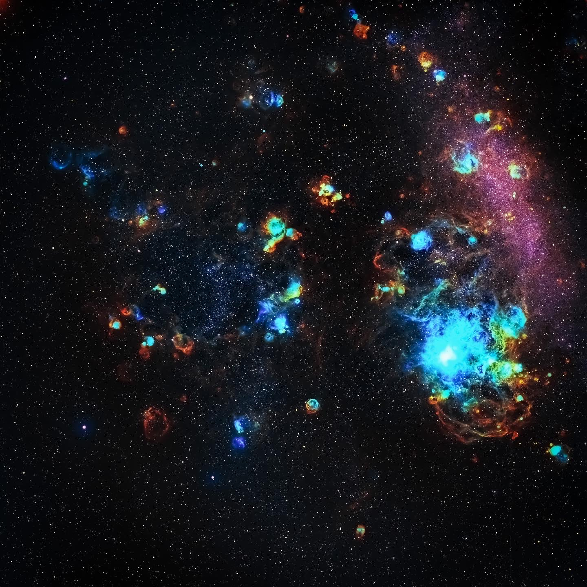

[The Large Magellanic Cloud](https://en.wikipedia.org/wiki/Large_Magellanic_Cloud) (LMC), or Nubecula Major is a satellite galaxy of the Milky Way. At a distance of around 50 kiloparsecs (≈160,000 light-years), the LMC is the second- or third-closest galaxy to the Milky Way, after the Sagittarius Dwarf Spheroidal (~16 kpc) and the possible dwarf irregular galaxy known as the Canis Major Overdensity. Based on readily visible stars and a mass of approximately 10 billion solar masses, the diameter of the LMC is about 14,000 light-years (4.3 kpc). It is roughly a hundredth as massive as the Milky Way and is the fourth-largest galaxy in the Local Group, after the Andromeda Galaxy (M31), the Milky Way and the Triangulum Galaxy (M33).

The LMC is classified as a Magellanic spiral. It contains a stellar bar that is geometrically off center, suggesting that it was a barred dwarf spiral galaxy before its spiral arms were disrupted, likely by tidal interactions from the Small Magellanic Cloud (SMC) and the Milky Way's gravity.

With a declination of about −70°, the LMC is visible as a faint "cloud" from the southern hemisphere of the Earth and from as far north as 20° N. It straddles the constellations Dorado and Mensa and has an apparent length of about 10° to the naked eye, 20 times the Moon's diameter, from dark sites away from light pollution.

The Milky Way and the LMC are predicted to merge in approximately 2.4 billion years.

大麦哲伦星系又称大麦哲伦云（英语：Large Magellanic Cloud，简写为LMC），是银河系的一个卫星星系，距离约为50,000秒差距（～160,000光年），直径大约是银河系的1/20，恒星数量约为1/10（大约是100亿颗恒星）。虽然比大多数星系为大，但在讨论银河系的时候也会被当做矮星系。

大麦哲伦星系的形态类似不规则星系，但似乎有一些螺旋结构的痕迹。有些推测认为大麦哲伦星系以前是棒旋星系，受到银河系的重力扰动才成为不规则星系，因此在中央仍保有短棒的结构。在NASA银河系外数据库中依据哈伯星系分类为Irr/SB(s)m。

大麦哲伦星系是本星系群中第四大的星系，其余三个为第三大的三角座星系（M33）、第二大的银河系及第一大的仙女座星系（M31）。

在南半球的夜空中，大麦哲伦星系是一个昏暗的天体，跨立在山案座和剑鱼座两个星座的边界之间。它的名称来自航海家斐迪南·麦哲伦，在他绕行地球一周的远航中观察了它与小麦哲伦星系（SMC）。（其实早在约公元964年，波斯天文学家阿布德·热哈曼·阿尔苏飞就已经在恒星之书（Book of Fixed Stars）中记录了这两个星系。

---

SPECS: 
- Location: Chile
- Remote Observatory CHI-1