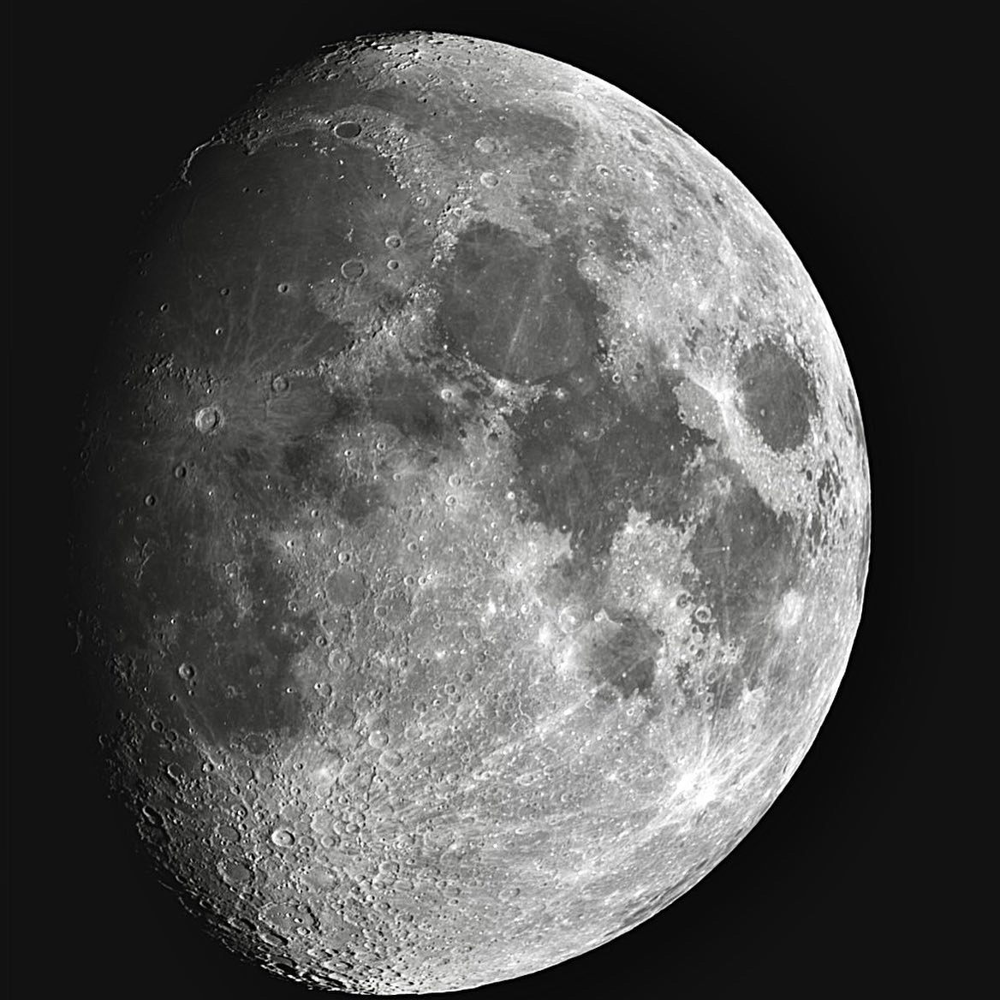

The [Moon](https://en.wikipedia.org/wiki/Moon) is Earth's only natural satellite. At about one-quarter the diameter of Earth (comparable to the width of Australia), it is the fifth largest satellite in the Solar System, the largest satellite in the Solar System relative to its major planet,[f] and larger than any known dwarf planet. The Moon is a planetary-mass object that formed a differentiated rocky body, making it a satellite planet under the geophysical definitions of the term. It lacks any significant atmosphere, hydrosphere, or magnetic field. Its surface gravity is about one-sixth of Earth's (0.1654 g). Jupiter's moon Io is the only satellite in the Solar System known to have a higher surface gravity and density.

Orbiting Earth at an average distance of 384,400 km (238,900 mi), or about 30 times Earth's diameter, its gravitational influence very slowly lengthens Earth's day and is the main driver of Earth's tides. The Moon's orbit around Earth has a sidereal period of 27.3 days. During each synodic period of 29.5 days, the amount of visible surface illuminated by the Sun varies from none up to 100%, resulting in lunar phases that form the basis for the months of a lunar calendar. The Moon is tidally locked to Earth, which means that the length of a full rotation of the Moon on its own axis causes its same side (the near side) to always face Earth, and the somewhat longer lunar day is the same as the synodic period. That said, 59% of the total lunar surface can be seen from Earth through shifts in perspective due to libration.

The most widely accepted origin explanation posits that the Moon formed 4.51 billion years ago, not long after Earth, out of the debris from a giant impact between the planet and a hypothesized Mars-sized body called Theia. It then receded to a wider orbit because of tidal interaction with the Earth. The near side of the Moon is marked by dark volcanic maria ("seas"), which fill the spaces between bright ancient crustal highlands and prominent impact craters. Most of the large impact basins and mare surfaces were in place by the end of the Imbrian period, some three billion years ago. The lunar surface is relatively non-reflective, with a reflectance just slightly brighter than that of worn asphalt. However, because it has a large angular diameter, the full moon is the brightest celestial object in the night sky. The Moon's apparent size is nearly the same as that of the Sun, allowing it to cover the Sun almost completely during a total solar eclipse.

Both the Moon's prominence in the earthly sky and its regular cycle of phases have provided cultural references and influences for human societies throughout history. Such influences can be found in language, calendar systems, art, and mythology. The first artificial object to reach the Moon was the Soviet Union's Luna 2 uncrewed spacecraft in 1959; this was followed by the first successful soft landing by Luna 9 in 1966. The only human lunar missions to date have been those of the United States' Apollo program, which landed twelve men on the surface between 1969 and 1972. These and later uncrewed missions returned lunar rocks that have been used to develop a detailed geological understanding of the Moon's origins, internal structure, and subsequent history.

月球，即地卫一，俗称月亮，是地球唯一的天然卫星，直径略大于地球的四分之一，质量约为地球的1/81，相对于所环绕的行星，它是体积和质量最大的卫星，并且是太阳系中第五大的卫星，也是太阳系内密度第二高的卫星，仅次于木卫一。

一般认为月亮形成于约45亿年前，即地球出现后的不久。有关它的起源有几种假说，但没有一种能完全合理地作毫无破绽的解释，最被普遍认可的是大碰撞说，它假设月球形成于地球与火星般大小的“特亚”之间的一次巨大撞击。

它的自转与公转同步（潮汐锁定），因此以同一面朝向地球。月球正面标记着黑暗的火山熔岩海，中间夹杂着明亮和古老地壳的高地和明显的陨石坑。从地球用肉眼观测，月球是除了太阳之外最亮的天体，尽管它看起来非常明亮，但其表面实际很暗，反射率仅略高于旧沥青。由于月球在天空中非常容易被观测，再加上规律性的月相变化，使它自古以来就对人类文化如历法、艺术和神话等产生重大影响。月球的引力影响造成地球海洋的潮汐和每一天的时间延长。月球现在与地球的距离，大约是地球直径的30倍，换而言之，将太阳系八大行星外加冥王星塞进地球与月球间还有余剩空间。而月球与太阳的大小比率与距离的比率相近，使得它的视觉大小与太阳几乎相同，在日食时月球可以完全遮蔽太阳而形成日全食。

月球是第一个人类曾经登陆过的地外星球。前苏联的月球计划在1959年发射了第一艘登月的无人太空船，而美国NASA的阿波罗计划是到目前为止，唯一实现的载人登月任务。阿波罗8号在1968年曾载人环绕月球，1969年阿波罗11号首次载人登陆月球，至1972年人类共六次登月成功。这些任务总共带回超过380公斤的月球岩石，其中有些被用于研究月球的地质，以了解月球的起源（通过相关的研究提出月球形成于45亿年前的巨大撞击假说），月球内部结构形成以及月球形成后的历史。在1972年阿波罗17号之后，只有无人太空船继续拜访月球，其中最值得一提的是苏联的月球步行者漫游车。自从2004年，日本、中国、印度、美国和欧洲空间局都发射了绕月卫星。这些太空探测器确认了月球极区上永久阴暗的坑穴的土壤中有水冰的存在。2019年中国的探测器嫦娥四号首次登陆月球背面进行勘察，次年嫦娥五号携带月壤样本于2020年12月17日1时59分返回地球。 现在人类有载人重新登陆探测月球的计划，例如美国重返月球计划、中国探月工程等已经确定实施，但细节均在研议阶段，短时间内还未能成行。现在在外太空条约下，月球依然是所有国家以和平的用途可以自由前往探测的场所。

---

SPECS:
- Location: Beijing
- Bortle Scale: 6
- Ha: 500 frames
- Software: PixInsight, DeNoise AI

DEVICES:
- Telescope: WO Redcat51
- Filter Wheel: ZWO 7*36mm EFW Filters: LRGB, Ha 7nm, SII 6.5nm, OIII 6.5nm
- Main Camera: ZWO 294MMP
- Guiding Camera: ZWO 290mini
- Focuser: ZWO EAF
- Computer: ZWO ASIAIR Plus
- Mount: RST-135
- Tripod: RT90C