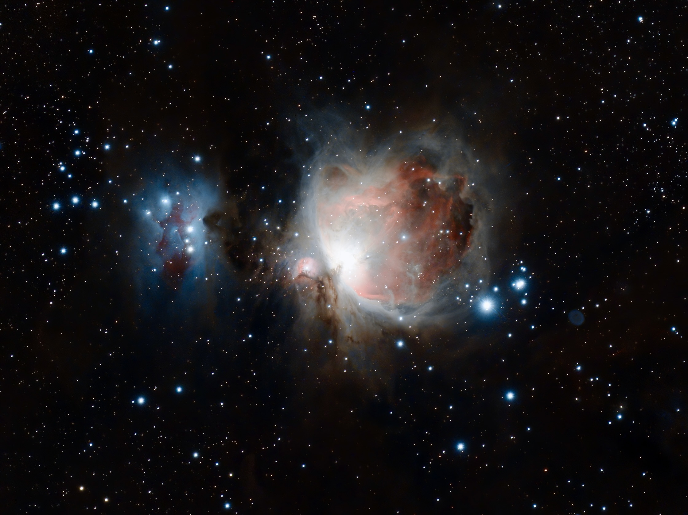

[The Orion Nebula](https://en.wikipedia.org/wiki/Orion_Nebula) (also known as Messier 42, M42, or NGC 1976) is a diffuse nebula situated in the Milky Way, being south of Orion's Belt in the constellation of Orion.[b] It is one of the brightest nebulae and is visible to the naked eye in the night sky with apparent magnitude 4.0. It is 1,344 ± 20 light-years (412.1 ± 6.1 pc) away and is the closest region of massive star formation to Earth. The M42 nebula is estimated to be 24 light-years across (so its apparent size from Earth is approximately 1 degree). It has a mass of about 2,000 times that of the Sun. Older texts frequently refer to the Orion Nebula as the Great Nebula in Orion or the Great Orion Nebula.

The Orion Nebula is one of the most scrutinized and photographed objects in the night sky and is among the most intensely studied celestial features. The nebula has revealed much about the process of how stars and planetary systems are formed from collapsing clouds of gas and dust. Astronomers have directly observed protoplanetary disks and brown dwarfs within the nebula, intense and turbulent motions of the gas, and the photo-ionizing effects of massive nearby stars in the nebula.

猎户座大星云（M42，NGC 1976）是一个位于猎户座的弥漫星云，距地球1344 ± 20光年，为最接近我们的一个恒星形成区。它的亮度相当高，在全天仅次于船底座星云，在无光害的地区用肉眼就可观察。

对于天文爱好者而言，M42是一个相当值得一看的深空天体：只要一枝小望远镜或双筒望远镜就可以观赏了。对于天文学家而言，这个星云是一个热门的研究对象，由大型的地基望远镜，到哈勃太空望远镜（HST）都指向它。猎户座大星云还是天文摄影爱好者和天文台的大望远镜最主要的拍摄对象之一。

近年天文学家已直接观测到该星云四合星附近的原行星盘（Protoplanetary disk）、棕矮星、气体激烈且混乱的运动，和附近大量出现的光子化恒星。M42是研究恒星诞生的观测、研究目标之一。

---

SPECS:
- Location: Lijiang, Yunnan, China
- Bortle Scale: 3
- Ha: 20 * 300
- Software: Lightroom iOS 

DEVICES:
- Telescope: WO Redcat51
- Filter Wheel: ZWO 7*36mm EFW Filters: LRGB, Ha 7nm, SII 6.5nm, OIII 6.5nm
- Main Camera: ZWO 294MMP
- Guiding Camera: ZWO 290mini
- Focuser: ZWO EAF
- Computer: ZWO ASIAIR Plus
- Mount: RST-135
- Tripod: RT90C