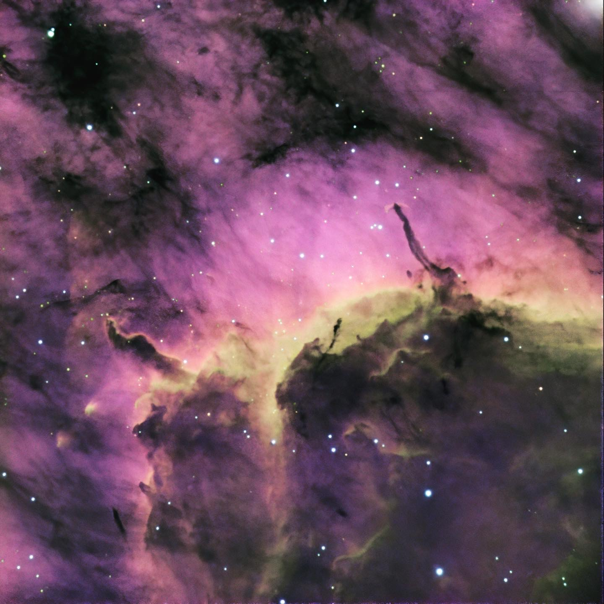

[The Pelican Nebula](https://en.wikipedia.org/wiki/Pelican_Nebula) (also known as IC 5070 and IC 5067) is an H II region associated with the North America Nebula in the constellation Cygnus. The gaseous contortions of this emission nebula bear a resemblance to a pelican, giving rise to its name. The Pelican Nebula is located nearby the first magnitude star Deneb, and is divided from its more prominent neighbour, the North America Nebula, by a foreground molecular cloud filled with dark dust. Both are part of the larger H II region of Westerhout 40.

The Pelican is much studied because it has a particularly active mix of star formation and evolving gas clouds. The light from young energetic stars is slowly transforming cold gas into hot and causing an ionization front gradually to advance outward. Particularly dense filaments of cold gas are seen to still remain, and among these are found two jets emitted from the Herbig–Haro object 555. Millions of years from now this nebula might no longer be known as the Pelican, as the balance and placement of stars and gas will leave something that appears completely different.

鹈鹕星云（也就是所知的IC 5070和IC 5067）是在天鹅座与北美洲星云结合在一起的一个电离氢区。这个发射星云的型状与鹈鹕相似，因此得到这个名称。鹈鹕星云是在天鹅座靠近天津四，占有很大面积的一个巨大发射星云，并且被一个充满暗尘埃的分子云，与相邻的更亮与更大的北美洲星云分隔开来。

因为具有特别活跃的恒星形成和气体演化的混合，因此对鹈鹕星云有很多的研究。来自年轻恒星充满活力的光，使冷的气体慢慢转化变热，并导致电离的波前逐渐向外推进，但特别浓密的丝状冷气体依然存在。从现在起的数百万年后，这个星云将不再是现在所认识的鹈鹕星云，恒星和气体的平衡将展现出与现在完全不同的外观。

---

SPECS: 
- Location: Spain
- Remote Observatory SPA-2