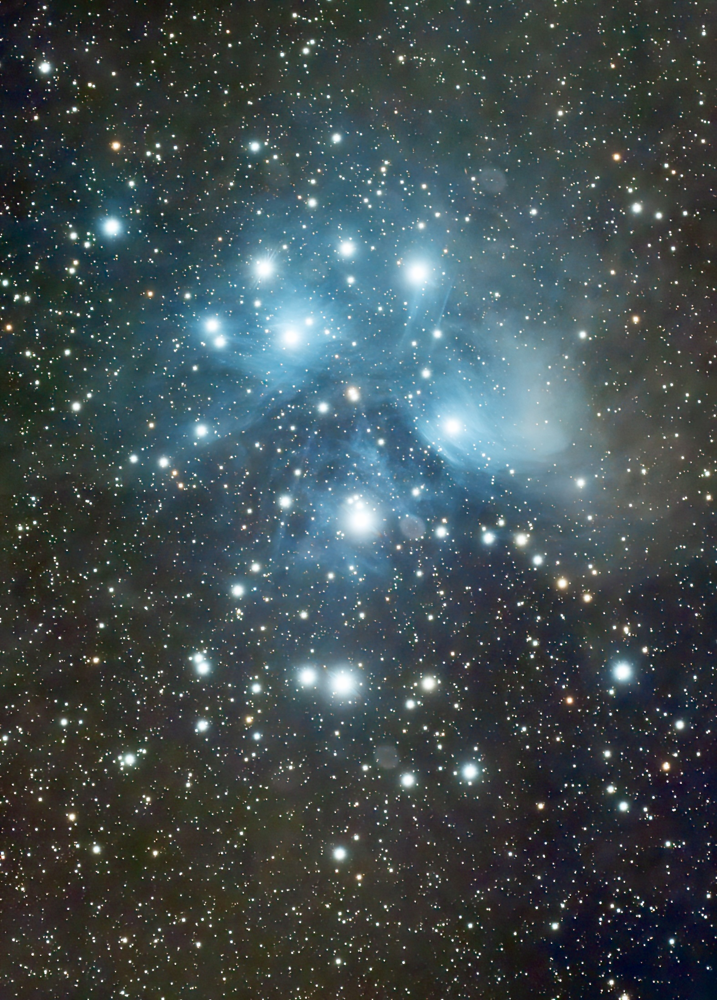

[The Pleiades](https://en.wikipedia.org/wiki/Pleiades) (/ˈpliː.ədiːz, ˈpleɪ-, ˈplaɪ-/), also known as The Seven Sisters, Messier 45, and other names by different cultures, is an asterism and an open star cluster containing middle-aged, hot B-type stars in the north-west of the constellation Taurus. At a distance of about 444 light years, it is among the nearest star clusters to Earth. It is the nearest Messier object to Earth, and is the most obvious cluster to the naked eye in the night sky.

The cluster is dominated by hot blue and luminous stars that have formed within the last 100 million years. Reflection nebulae around the brightest stars were once thought to be left over material from their formation, but are now considered likely to be an unrelated dust cloud in the interstellar medium through which the stars are currently passing. This dust cloud is estimated to be moving at a speed of approximately 18 km/s relative to the stars in the cluster.

Computer simulations have shown that the Pleiades were probably formed from a compact configuration that resembled the Orion Nebula. Astronomers estimate that the cluster will survive for about another 250 million years, after which it will disperse due to gravitational interactions with its galactic neighborhood.

Together with the open star cluster of the Hyades, the Pleiades form the Golden Gate of the Ecliptic.

昴宿星团，简称昴星团，又称七姊妹星团，梅西耶星云星团表编号M45，是一个大而明亮的疏散星团，位于金牛座，裸眼就可以轻易看见，肉眼通常见到有九颗亮星。昴星团的视直径约2°，形成斗状。成员星数在200个以上，是一个很年轻的星团。昴星团也是一个移动星团。

昴宿星团的云气是最接近地球的星云之一，并且可能是最著名的。它有时被称为玛亚女神的星云，这种错误或许是因为反射星光的云气本质上是环绕在迈亚的四周所造成的。

这群以蓝色高温恒星为主的星团是在最近的一亿年形成的，由微量的灰尘形成的反射星云围绕在最亮星的附近，起初被认为是星团形成时留下的，但是现在知道只是目前正在经过，与星团无关的尘埃云。天文学家估计这个星团大约可以再存在二亿五千万年，之后就会被银河系的引力扯碎，散布在邻近的星空之中。

---

SPECS:
- Location: Beijing
- Bortle Scale: 6
- L: 80 * 60
- R: 60 * 120
- G: 50 * 120
- B: 80 * 120
- Software: PixInsight, DeNoise AI

DEVICES:
- Telescope: WO Redcat51
- Filter Wheel: ZWO 7*36mm EFW Filters: LRGB, Ha 7nm, SII 6.5nm, OIII 6.5nm
- Main Camera: ZWO 294MMP
- Guiding Camera: ZWO 290mini
- Focuser: ZWO EAF
- Computer: ZWO ASIAIR Plus
- Mount: RST-135
- Tripod: RT90C