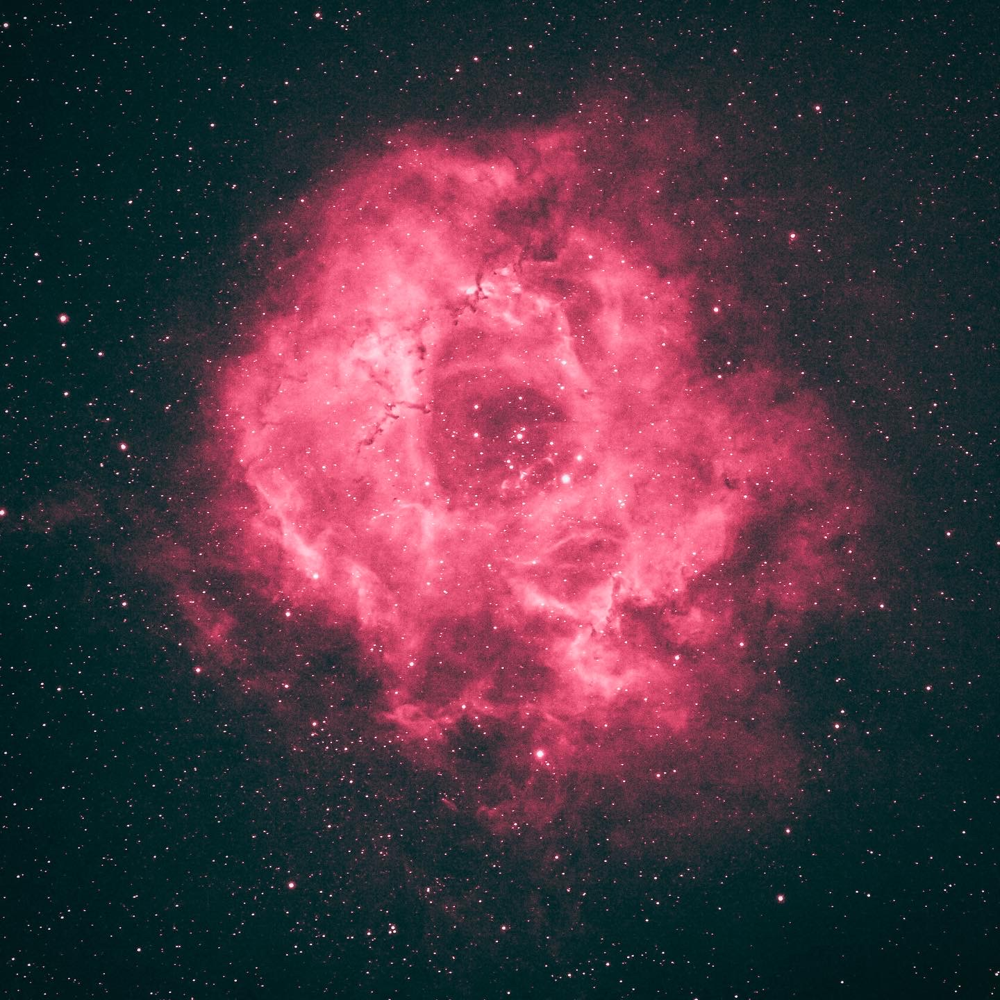

The Rosette Nebula (also known as Caldwell 49) is an H II region located near one end of a giant molecular cloud in the Monoceros region of the Milky Way Galaxy. The open cluster NGC 2244 (Caldwell 50) is closely associated with the nebulosity, the stars of the cluster having been formed from the nebula's matter.

The complex has the following New General Catalogue (NGC) designations:

- NGC 2237 – Part of the nebulous region (Also used to denote whole nebula)

- NGC 2238 – Part of the nebulous region

- NGC 2239 – Part of the nebulous region (Discovered by John Herschel)

- NGC 2244 – The open cluster within the nebula (Discovered by John Flamsteed in 1690)[citation needed]

- NGC 2246 – Part of the nebulous region

The cluster and nebula lie at a distance of 5,000 light-years from Earth and measure roughly 130 light years in diameter. The radiation from the young stars excites the atoms in the nebula, causing them to emit radiation themselves producing the emission nebula we see. The mass of the nebula is estimated to be around 10,000 solar masses.

A survey of the nebula with the Chandra X-ray Observatory has revealed the presence of numerous new-born stars inside optical Rosette Nebula and studded within a dense molecular cloud. Altogether, approximately 2500 young stars lie in this star-forming complex, including the massive O-type stars HD 46223 and HD 46150, which are primarily responsible for blowing the ionized bubble. Most of the ongoing star-formation activity is occurring in the dense molecular cloud to the south east of the bubble.

A diffuse X-ray glow is also seen between the stars in the bubble, which has been attributed to a super-hot plasma with temperatures ranging from 1 to 10 million K. This is significantly hotter than the 10,000 K plasmas seen in HII regions, and is likely attributed to the shock-heated winds from the massive O-type stars.

On April 16, 2019 the Oklahoma Legislature passed HB1292 making the Rosette Nebula as the official state astronomical object. Oklahoma Governor Kevin Stitt signed it into law April 22, 2019.

玫瑰星云（也称为科德韦尔49 ）是一个大的球形电离氢区（外观呈现圆形），位置在麒麟座，是银河系内的一个巨大分子云接近末端的部分。 疏散星团NGC 2244（科德韦尔50）内的恒星是由这个星云的物质形成的，因此与这个星云紧密的结合。

这一群星云包括下列几个NGC天体：

- NGC 2237 – 星云的一部分（也用来表示整个星云）
- NGC 2238 – 星云的一部分
- NGC 2239 – 星云的一部分（被约翰·赫歇尔发现）
- NGC 2244 – 在星云内的疏散星团 （在1690年发现被约翰·佛兰斯蒂德）
- NGC 2246 – 星云的一部分

这个星团和星云距离地球约5,000光年，测量得到的直径大约是130光年。来自年轻恒星的辐射激发星云中的原子，使得这个星云成为我们看见的发射星云。估计星云的质量大约是10,000太阳质量。

钱德拉X射线天文台对这个星云的调查显示，在玫瑰星云内有许多新诞生的光学恒星镶嵌在稠密的分子云中。总共有大约2,500颗恒星存在于这个恒星形成的复合体内，包括大质量的O型星 HD 46223和HD 46150，主要负责吹出电离的气泡。 大部分正在进行的恒星形成活动都发生在致密的分子云中朝向东南的气泡。

在气泡中的恒星之间，也可以看见弥漫的X射线辉光，这归因于温度从100万至1,000万K的超高温等离子。 这比电离氢区的10,000K等离子要热得多，而这很可能是由大质量的O形星产生的冲击波热风引起的。

---

SPECS:
- Location: Lijiang, Yunnan, China
- Bortle Scale: 3
- Ha: 30 * 300
- Software: Lightroom iOS 

DEVICES:
- Telescope: WO Redcat51
- Filter Wheel: ZWO 7*36mm EFW Filters: LRGB, Ha 7nm, SII 6.5nm, OIII 6.5nm
- Main Camera: ZWO 294MMP
- Guiding Camera: ZWO 290mini
- Focuser: ZWO EAF
- Computer: ZWO ASIAIR Plus
- Mount: RST-135
- Tripod: RT90C
