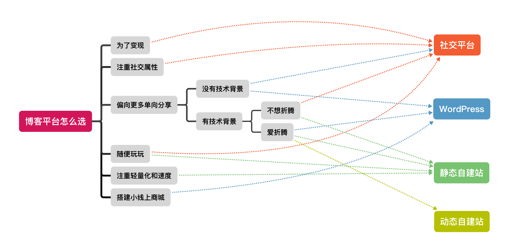
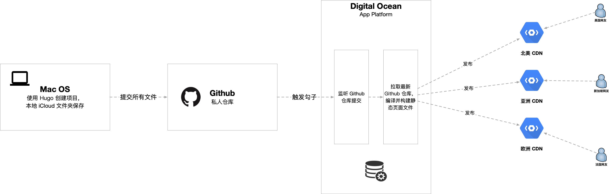

## 为什么要使用博客

- 有分享的诉求，与他人链接
- 有可分享的想法
- 希望与他人互动，碰撞出新的想法

---

## 个人核心需求

- 能够编辑/发布/删除文章
- 文章包含文字/链接/图片
- 拥有完整个人产出的数字资产的所属权
- 尽可能少泄露使用痕迹，避免定向广告投放以及可能存在的信息茧房
- 轻量化
- 易迁移
- 速度快

---

## 市面上存在的选择

为了满足公共表达这一核心需求的可选项非常多，从注重社交属性的社交平台，到极客们的自建站；品目繁多，应有尽有。

### 社交平台

各类的短博客，长博客选择非常广，从国内的[新浪微博](https://weibo.com/)，[小红书](http://www.xiaohongshu.com/)，[知乎](http://www.zhihu.com/) 到国外的 [Instagram](https://www.instagram.com/)，[Tumblr](https://www.tumblr.com/)，[Medium](https://medium.com/) 方方面面总有一款适合你，几乎所有社交平台的博客必定有数据库和后台。

#### 优点

- 免费
- 开箱即用
- 产品众多，可选择范围广
- 基于平台流量，更高的曝光率
- 社交属性非常强
- 多种客户端支持，使用便利

#### 缺点

- 数据所有权属于平台
- 各产品功能涵盖范围不一，没有克制化的能力
- 国内平台强制要求注册，收集手机号等敏感的个人身份数据
- 所有个人使用数据属于平台，并用于其商业目的

### 付费/自建混合

这一类的个人站与平台化的博客产品不同在于，其提供了一定的克制化能力。如 [WordpPress](https://wordpress.com/) 为代表的一套开源免费的成熟平台（其他如[Ghost](https://ghost.org/) ），同时如果不愿折腾或缺乏技术背景，也提供商业运营的按需付费模式，并通过插件的形式来一定程度上提供可制化的能力。

同时满足爱折腾和不爱折腾两大类用户，非常的有可玩性。同时这一类生态也是动态博客，意味着后台有数据库和一个 web 服务器来对外提供服务。

#### 优点

- 相比于社交平台，提供更多的客制化能力
- 免费/付费两种模式满足不同用户
- 如果选择自建站，则数据所有权在建站者手中
- WordPress 有大量插件
- 非常成熟的社区支持

#### 缺点

- 如果没有技术背景，则需要付费
- 对于追求极简轻便的自建站玩家，整个生态太重

### 自建站

对于动手能力强且有技术背景的同学来说，自建的魅力在于，**你拥有整个自建产品的完整生命周期**。从内容，样式到技术架构，每一个点都可随心设计。

#### 优点

- it's your site you can do whatever you want
- 静态博客可以做到绝对安全
- 静态博客及其轻量
- 拥有完整数字资产的所属权
- 静态博客由于是直接返回 HTML，可以通过全球 CDN 加速做到非常快的站点响应速度

#### 缺点

- 有一定的技术门槛和对动手能力的需求
- 如果不使用 Github Page 作为发布模版（国内裸连 Github 可能被墙），需要额外租服务器的费用，大概3-5美元一个月

从技术的角度来说，自建站博客主要分为两大类：动态博客 和 静态博客，下面分别来谈一谈它们是什么。

#### 动态自建站

动态博客意味着数据是实时渲染的，不论是像 React 这一类可以渲染局部的单页应用框架，还是在服务端实时渲染 HTML 返回的 JSP；它们的设计思路决定了这一类系统必然存在后台系统；通过 API 与数据库交互，实时获取局部/完整网页的数据，返回给浏览器。

在能够满足复杂业务逻辑的同时，这样的系统往往意味着高复杂度；带来的运维压力对个人建站者来说是一大挑战。

#### 静态自建站

> 引用一段英文关于 SSG 的描述：
>
> *Think of a static site generator as a script which takes in data, content and templates, processes them, and outputs a folder full of all the resultant pages and assets.*

静态博客其本质就是 HTML 文件，无论用何种方式生成，通过 Web 服务器对外提供服务，交由浏览器渲染。其最大的优势就是**轻量**；对于互联网上浏览的用户，由于是已经生成好的最终网页文件，所以**绝对安全**。

市面上有不少的 [Static Site Generator（SSG）](https://www.netlify.com/blog/2020/04/14/what-is-a-static-site-generator-and-3-ways-to-find-the-best-one/)，如 [Hexo](https://hexo.io/), [Jelly](https://www.jelly.org/jelly-blog), [Hugo](https://gohugo.io/) 可以用来静态生成静态站点，用户可以基于这些 SSG 做二次开发，在 HTML & JS 以及对应 SSG 开发语言所提供的能力范围内任意客制化。

---

### 怎么选

---

### 总结

基于我的核心需求，最终的选择是 [Hugo](https://gohugo.io/) ，一款基于 Go 语言开发的 SSG，完美支持 Markdown 语法。相比于  [Hexo](https://hexo.io/) 每次非常耗时的全量编译，Hugo 的增量编译将在文章数量多的时候有着决定性的优势，因为个人的核心需求之一就是轻量和快。

架构设计非常轻便，同时 Markdown 文件的通用性也为未来的迁移提供保障。

